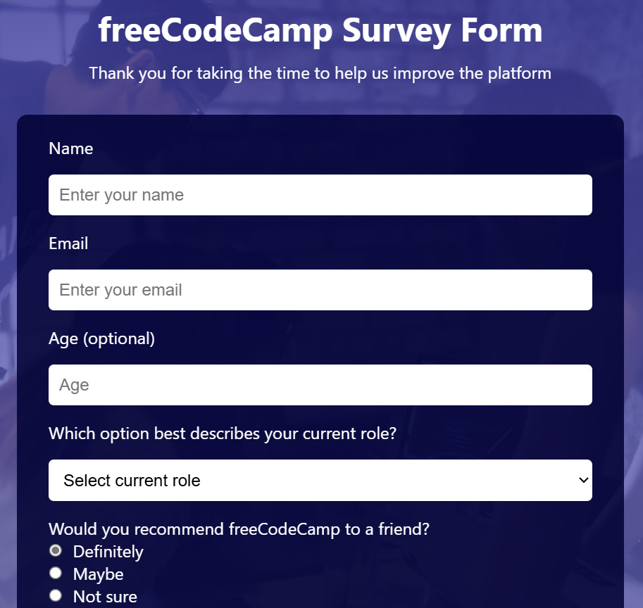
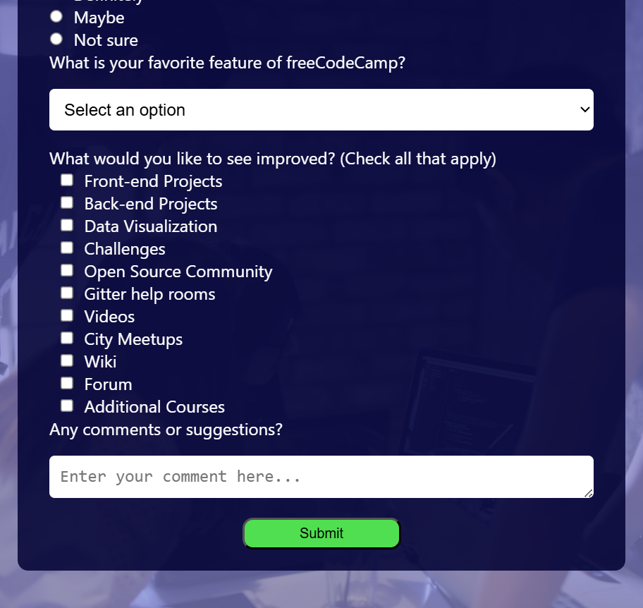

# freeCodeCamp Survey Form

This is a responsive and styled survey form created as part of the [freeCodeCamp](https://www.freecodecamp.org/) Responsive Web Design certification project.

## 💡 Features

- Fully responsive layout
- Gradient overlay background image
- Accessible form fields with labels
- Radio buttons, checkboxes, and dropdowns
- Clean, user-friendly UI design

## 🖼️ Preview

## 🚀 Technologies Used

- HTML5
- CSS3 (Flexbox, gradients, responsive layout)

## 🔗 Live Demo

👉 (https://prakash-123705.github.io/survey-form/)

## 📚 Learn More

This project is based on the [Survey Form Project](https://www.freecodecamp.org/learn/responsive-web-design/responsive-web-design-projects/build-a-survey-form) from the freeCodeCamp curriculum.
